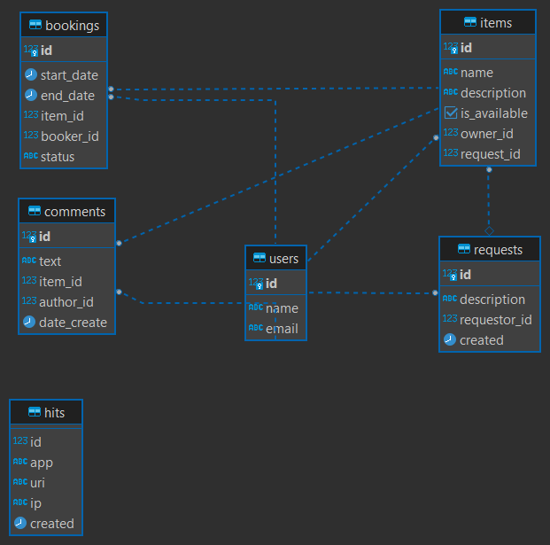

Shareit project.
Проект по шейрингу вещей, можно брать, сдавать в аренду предметы, оставлять заявки и комментировать бронирования.

Стек: Java 11, Maven, SpringBoot(2.7.9),Docker

Схема базы данных проекта:

Планы по развитию:
- Добавление подписок на пользователей для того, чтобы можно было отслеживать новые предметы пользователя
- рейтинг пользователей по сдаче в аренду и по использованию вещей в аренде